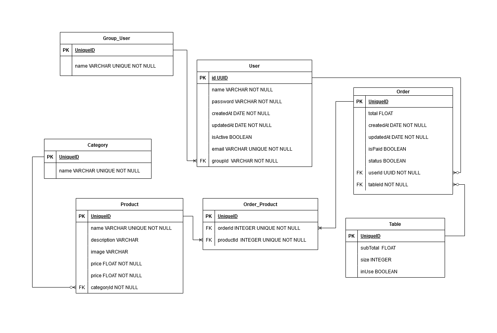

# Documentação da API

## Tabela de Conteúdos

- [Visão Geral](#1-visão-geral)
- [Diagrama ER](#2-diagrama-er)
- [Início Rápido](#3-início-rápido)
  - [Instalando Dependências](#31-instalando-dependências)
  - [Variáveis de Ambiente](#32-variáveis-de-ambiente)
  - [Migrations](#33-migrations)
- [Tipos de Usuários](#4-tipos)
- [Endpoints](#4-endpoints)
- [Testes](#5)

---

## 1. Visão Geral

Essa api busca implementar um sistema de gerenciamento de pedidos de e integração de estoque, através de um intermediário que poderá adicionar produtos a um pedido e criar novos produtos e categorias (apenas administrador)

O projeto cria por padrão um usuário root, que será usado como base para criação de outros usuários e acesso à rotas que necessitem permissões de administrador. Para usa-lo, faça o login da endpoint /login com os seguintes dados:

```JSON
{
  "email": "root@root.com",
  "password": "123456"
}
```

Atenção: É importante estudar o diagrama ER e entender seus relacionamentos. Linhas de uma tabela relacionadas à linhas de outras tabelas poderão causar conflitos de deletes, e estes retornarão o erro:
```JSON
{
	"message": "Internal server error"
}
```

Visão geral do projeto, um pouco das tecnologias usadas.

- [NodeJS](https://nodejs.org/en/)
- [Express](https://expressjs.com/pt-br/)
- [TypeScript](https://www.typescriptlang.org/)
- [PostgreSQL](https://www.postgresql.org/)
- [TypeORM](https://typeorm.io/)
- [Jest](https://jestjs.io/pt-BR/docs/getting-started)

URL base da aplicação: https://m4donalds.herokuapp.com/

---

## 2. Diagrama ER

[ Voltar para o topo ](#tabela-de-conteúdos)

Diagrama ER da API definindo bem as relações entre as tabelas do banco de dados.



---

## 3. Início Rápido

[ Voltar para o topo ](#tabela-de-conteúdos)

### 3.1. Instalando Dependências

Clone o projeto em sua máquina e instale as dependências com o comando:

```shell
yarn
```

### 3.2. Variáveis de Ambiente

Em seguida, crie um arquivo **.env**, copiando o formato do arquivo **.env.example**:

```
cp .env.example .env
```

Configure suas variáveis de ambiente com suas credenciais do Postgres e uma nova database da sua escolha.

### 3.3. Migrations

Execute as migrations com o comando:

```
yarn typeorm migration:run -d src/data-source.ts
```

### 3.4. Testes
Diversos testes já estão implementados no projeto. Para rodar cada um deles, deve-se atentar às seguintes observações:
- Definir as variáveis de ambiente de acordo com o arquivo .env-example
- Antes de executar cada teste, deletar todo o banco de dados de TESTE e cria-lo novamente, no ambiente desejado (recomenda-se o BeeKeper). Pular este passo pode ocasionar erros de testes
- Para rodar os testes, execute o seguinte comando:
```
yarn test
```


---

## 4. Tipos de Usuário

Os tipos de grupo a serem enviados em forma de string na requisição de usuário devem se referir ao id de um dos seguintes grupos:

- ID: Tipo de grupo
- 1: Administrador
- 2: Garçom
- 3: Caixa

* Obs: Estes tipos de usuário já serão previamente criados no banco de dados.

---

## Erros padrão

- Os retornos de erro seguirão o seguinte padrão para todas as requisições:

```JSON
{ "message": "string" }
```

## 5. Endpoints

[ Voltar para o topo ](#tabela-de-conteúdos)

### Índice

- [Users](#1-users)
  - [POST - /users](#11-criação-de-usuário)
  - [GET - /users](#12-listando-usuários)
  - [DELETE - /users/:id](#13-deletar-um-usuário)
  - [PATCH - /users/:id](#14-atualizar-usuario-por-id)
- [Login](#2)
  - [POST - /login](#15-login-usuario)
- [Categories](#2-products)
  - [POST /categories](#16)
  - [GET /categories](#17)
  - [PATCH /categories/:id](#18)
  - [DELETE /categories/:id](#19)
  - [GET /categories/:id](#20)
- [Orders](#3-cart)
  - [POST /orders](#21)
  - [GET /orders](#22)
  - [PATCH /orders/:id](#23)
  - [DELETE /orders/:id](#24)
  - [GET /orders/:id](#25)
- [Products](#4-buys)
  - [POST /products](#26)
  - [GET /products](#27)
  - [PATCH /products/:id](#28)
  - [DELETE /products/:id](#29)
- [Tables](#5)
  - [POST /tables](#21)
  - [GET /tables](#22)
  - [PATCH /tables/:id](#23)
  - [DELETE /tables/:id](#24)
  - [GET /tables/:id](#25)
- [Order-Products](#6)
  - [POST /order/product](#26)
  - [DELETE /order/product/:id](#27)

---

## 1. **Users**

[ Voltar para os Endpoints ](#5-endpoints)

O objeto User é definido como:

| Campo     | Tipo    | Descrição                                    |
| --------- | ------- | -------------------------------------------- |
| id        | string  | Identificador único do usuário               |
| name      | string  | O nome do usuário.                           |
| email     | string  | O e-mail do usuário.                         |
| isActive  | boolean | Indica status de atividade (true por padrão) |
| groupUser | objeto  | Possui id e name. Indica o tipo de usuário   |
| password  | string  | A senha de acesso do usuário                 |
| createdAt | Date    | Indica data de criação do usuário            |
| updatedAt | Date    | Indica data de última atualização do usuário |

### Endpoints

| Método | Rota       | Descrição                                      |
| ------ | ---------- | ---------------------------------------------- |
| POST   | /users     | Criação de um usuário.                         |
| GET    | /users     | Lista todos os usuários                        |
| DELETE | /users/:id | Soft delete do usuário (muda isActive = false) |
| PATCH  | /users/:id | Atualiza campos do usuário passado por ID      |

---

### 1.1. **Criação de Usuário**

[ Voltar para os Endpoints ](#5-endpoints)

### `/users`

### Exemplo de Request:

```
POST /users
Authorization: Token e ser usuário administrador
```

### Corpo da Requisição:

```json
{
  "name": "Marcelo",
  "email": "marcelo@mail.com",
  "password": "1234",
  "groupName": "Administrador"
}
```

### Exemplo de Response:

```
201 Created
```

```json
{
  "email": "marcelo@mail.com",
  "groupUser": {
    "id": 1,
    "name": "Administrador"
  },
  "name": "Marcelo",
  "id": "554d41e7-b3eb-4baf-8697-051a2c2f6e7a",
  "isActive": true,
  "createdAt": "2022-09-13",
  "updatedAt": "2022-09-13"
}
```

### Possíveis Erros:

| Código do Erro | Descrição                 |
| -------------- | ------------------------- |
| 400 Conflict   | Email already registered. |

---

### 1.2. **Listando Usuários**

[ Voltar aos Endpoints ](#5-endpoints)

### `/users`

### Exemplo de Request:

```
GET /users
Authorization: Token e usuário do tipo Administrador
```

### Corpo da Requisição:

```
Vazio
```

### Exemplo de Response:

```
200 OK
```

```json
[
  {
    "id": "b9552e3a-01e3-4413-8a76-d9ccdb677393",
    "name": "root",
    "email": "root@root.com",
    "isActive": true,
    "password": "$2a$10$H6qwnHxpQB43S3h4jsA.QeB8ebeYF5vXEK0D/yMno7qe2t96/wAYW",
    "createdAt": "2022-09-13",
    "updatedAt": "2022-09-13",
    "groupUser": {
      "id": 1,
      "name": "Administrador"
    }
  }
]
```

### Possíveis Erros:

```JSON
{
	"message": "Invalid token"
}
```

---

### 1.3. **Atualizar um Usuário por ID**

[ Voltar aos Endpoints ](#5-endpoints)

### `/users/:id`

### Exemplo de Request:

```
PATCH /users/9cda28c9-e540-4b2c-bf0c-c90006d37893
Authorization: Token e usuário do tipo administrador
Atributos não atualizáveis: id, email (caso exista outro igual)
```

### Parâmetros da Requisição:

| Parâmetro | Tipo   | Descrição                             |
| --------- | ------ | ------------------------------------- |
| id        | string | Identificador único do usuário (User) |

### Corpo da Requisição:

```json
{
  "name": "Marcelo atualizado",
  "email": "emailAtualizado@mail.com",
  "password": "123",
  "groupUser": "Garçom",
  "isActive": true
}
```

### Exemplo de Response:

```
200 OK
```

```json
{
  "id": "2653bcdc-75e7-4341-9abd-5de947f69273",
  "name": "Marcelo atualizado",
  "email": "emailAtualizado@mail.com",
  "isActive": true,
  "password": "$2a$10$HH56nPf/kXmCCbFP6FAXQeyWp5J1ZEOJk7OUWjf/3Jr6KrocGIt5q",
  "createdAt": "2022-09-08",
  "updatedAt": "2022-09-08",
  "groupUser": {
    "id": 2,
    "name": "Garçom"
  }
}
```

### Possíveis Erros:

| Código do Erro | Descrição       |
| -------------- | --------------- |
| 400 Not Found  | User not found. |

---

### 1.4. **Deletar um Usuário por ID**

[ Voltar aos Endpoints ](#5-endpoints)

### `/users/:id`

### Exemplo de Request:

```
DELETE /users/9cda28c9-e540-4b2c-bf0c-c90006d37893
Authorization: Token e usuário do tipo administrador
```

### Parâmetros da Requisição:

| Parâmetro | Tipo   | Descrição                             |
| --------- | ------ | ------------------------------------- |
| id        | string | Identificador único do usuário (User) |

### Corpo da Requisição:

```
vazio
```

### Exemplo de Response:

```
200 OK
```

```json
{
  "message": "Usuário deletado com sucesso!"
}
```

### Possíveis Erros:

| Código do Erro  | Descrição           |
| --------------- | ------------------- |
| 409 Conflict    | User not found.     |
| 400 Bad Request | Usuário já deletado |

---

## 2. **Login**

[ Voltar para os Endpoints ](#5-endpoints)

### 2.1. **Login do Usuário**

### `/login`

### Exemplo de Request:

```
POST /login
Authorization: None
```

### Corpo da Requisição:

```json
{
  "email": "marcelo@mail.com",
  "password": "1234"
}
```

### Exemplo de Response:

```
200 Ok
```

```json
{
  "token": "ebJhbGciOiJIUzI1NiIsInR5cCI6IkpXVCJ9.eyJpc0FkbSI6MSwiaWQiOiJiOTU1MmUzYS0wMWUzLTQ0MTMtOGE3Ni1kOWNjZGI2NzczOTMiLCFpYXQiOjE2NjMwOTc4MzQsImV4cCI6MTY2MzE4NDIzNH0.gw9R_KST5TdN__DMx6Aj83KKbwmX-4UbNArYu0DGJo2"
}
```

### Possíveis Erros:

| Código do Erro | Descrição           |
| -------------- | ------------------- |
| 403 Forbidden  | Invalid Credentials |

---

## 3. **Categories**

[ Voltar para os Endpoints ](#5-endpoints)

O objeto Category é definido como:

| Campo | Tipo   | Descrição                        |
| ----- | ------ | -------------------------------- |
| id    | number | Identificador único da categoria |
| name  | string | Nome único da categoria na tabela|

### Endpoints

| Método | Rota            | Descrição                                   |
| ------ | --------------- | ------------------------------------------- |
| POST   | /categories     | Criação de uma categoria.                   |
| GET    | /categories     | Lista todos as categorias                   |
| GET    | /categories/:id | Lista uma única categoria, a partir do ID   |
| DELETE | /categories/:id | Delete da categoria                         |
| PATCH  | /categories/:id | Atualiza campos da categoria passada por ID |

---

### 3.1. **Criação de Categoria**

[ Voltar para os Endpoints ](#5-endpoints)

### `/categories`

### Exemplo de Request:

```
POST /categories
Authorization: Token e ser usuário administrador
```

### Corpo da Requisição:

```json
{
  "name": "Bebidas"
}
```

### Exemplo de Response:

```
201 Created
```

```json
{
  "name": "Bebidas",
  "id": 1
}
```

### Possíveis Erros:

| Código do Erro  | Descrição               |
| --------------- | ----------------------- |
| 400 Bad Request | Category already exists |

---

### 3.2. **Listando Categorias**

[ Voltar aos Endpoints ](#5-endpoints)

### `/categories`

### Exemplo de Request:

```
GET /categories
Authorization: None
```

### Corpo da Requisição:

```
Vazio
```

### Exemplo de Response:

```
200 OK
```

```json
[
  {
    "id": 1,
    "name": "Bebidas"
  }
]
```

---

### 3.3. **Atualizar uma Categoria por ID**

[ Voltar aos Endpoints ](#5-endpoints)

### `/categories/:id`

### Exemplo de Request:

```
PATCH /categories/1
Authorization: Token e usuário do tipo administrador
```

### Parâmetros da Requisição:

| Parâmetro  | Tipo   | Descrição                        |
| ---------- | ------ | -------------------------------- |
| id         | string | Identificador único da categoria |

### Corpo da Requisição:

```json
{
  "name": "Bebidas alcoólicas"
}
```

### Exemplo de Response:

```
200 OK
```

```json
{
  "id": 1,
  "name": "Bebidas Alcoólicas"
}
```

### Possíveis Erros:

| Código do Erro | Descrição          |
| -------------- | ------------------ |
| 404 Not Found  | Category not found |

---

### 3.4. **Deletar uma Categoria por ID**

[ Voltar aos Endpoints ](#5-endpoints)

### `/categories/:id`

### Exemplo de Request:

```
DELETE /categories/1
Authorization: Token e usuário do tipo administrador
```

### Parâmetros da Requisição:

| Parâmetro  | Tipo   | Descrição                        |
| ---------- | ------ | -------------------------------- |
| id         | string | Identificador único da categoria |

### Corpo da Requisição:

```
vazio
```

### Exemplo de Response:

```
200 OK
```

```json
{
  "message": "Category delete"
}
```

### Possíveis Erros:

| Código do Erro  | Descrição          |
| --------------- | ------------------ |
| 400 Bad Request | Category not found |

---

### 3.5. **Buscar uma Categoria por ID**

[ Voltar aos Endpoints ](#5-endpoints)

### `/categories/:id`

### Exemplo de Request:

```
GET /categories/9cda28c9-e540-4b2c-bf0c-c90006d37893
Authorization: Token e usuário do tipo administrador
```

### Parâmetros da Requisição:

| Parâmetro  | Tipo   | Descrição                        |
| ---------- | ------ | -------------------------------- |
| id         | string | Identificador único da categoria |

### Corpo da Requisição:

```
vazio
```

### Exemplo de Response:

```
200 OK
```

```json
{
  "id": 2,
  "name": "Bebidas alcoólicas"
}
```

### Possíveis Erros:

| Código do Erro  | Descrição          |
| --------------- | ------------------ |
| 400 Bad Request | Category not found |

---

## 4. **Orders**

[ Voltar para os Endpoints ](#5-endpoints)

O objeto Order é definido como:

| Campo     | Tipo    | Descrição                                    |
| --------- | ------- | -------------------------------------------- |
| id        | number  | Identificador único da categoria             |
| user      | User    | Usuário que criou a order                    |
| table     | Table   | Table ao qual a order está relacionada       |
| total     | string  | Subtotal da soma dos produtos da order       |
| isPaid    | boolean | Indicativo se a order foi paga ou não        |
| status    | boolean | Status de ativação da order (true = ativada) |
| createdAt | Date    | Data de criação da order                     |
| updatedAt | Date    | Date de atualização da order                 |

### Endpoints

| Método | Rota        | Descrição                                   |
| ------ | ----------- | ------------------------------------------- |
| POST   | /orders     | Criação de uma order.                   |
| GET    | /orders     | Lista todos as orders                   |
| GET    | /orders/:id | Lista uma única order, a partir do ID   |
| DELETE | /orders/:id | Delete da order                         |
| PATCH  | /orders/:id | Atualiza campos da order passada por ID |

---

### 4.1. **Criação de Order**

[ Voltar para os Endpoints ](#5-endpoints)

### `/orders`

### Exemplo de Request:

```
POST /orders
Authorization: Token
```

### Corpo da Requisição:

```json
{
  "user": "8e4e7dad-53a7-4bd4-aee9-25b804b0fcf9",
  "tableId": 1,
  "productId": 1
}
```

### Exemplo de Response:

```
201 Created
```

```json
{
  "user": {
    "id": "b9552e3a-01e3-4413-8a76-d9ccdb677393",
    "name": "root"
  },
  "table": {
    "id": 1,
    "subTotal": "0.00",
    "size": 5,
    "inUse": true
  },
  "id": 2,
  "total": "0.00",
  "isPaid": false,
  "status": true,
  "createdAt": "2022-09-13T20:24:13.906Z",
  "updatedAt": "2022-09-13T20:24:13.906Z"
}
```

### Possíveis Erros:

| Código do Erro | Descrição              |
| -------------- | ---------------------- |
| 404 Not Found  | Id products not exists |
| 404 Not Fount  | id table not exists    |

---

### 4.2. **Listando Orders**

[ Voltar aos Endpoints ](#5-endpoints)

### `/orders`

### Exemplo de Request:

```
GET /orders
Authorization: Token
```

### Corpo da Requisição:

```
Vazio
```

### Exemplo de Response:

```
200 OK
```

```json
[
  {
    "user": {
      "id": "b9552e3a-01e3-4413-8a76-d9ccdb677393",
      "name": "root"
    },
    "id": 2,
    "total": "0.00",
    "isPaid": false,
    "status": true,
    "createdAt": "2022-09-13T20:24:13.906Z",
    "updatedAt": "2022-09-13T20:24:13.906Z",
    "table": {
      "id": 1,
      "subTotal": "0.00",
      "size": 5,
      "inUse": true
    }
  },
  {
    "user": {
      "id": "b9552e3a-01e3-4413-8a76-d9ccdb677393",
      "name": "root"
    },
    "id": 1,
    "total": "2.20",
    "isPaid": false,
    "status": true,
    "createdAt": "2022-09-13T20:24:01.870Z",
    "updatedAt": "2022-09-13T20:32:48.071Z",
    "table": {
      "id": 1,
      "subTotal": "0.00",
      "size": 5,
      "inUse": true
    }
  }
]
```

### Possíveis Erros:

| Código do Erro   | Descrição     |
| ---------------- | ------------- |
| 401 Unauthorized | Invalid token |

---

### 4.3. **Atualizar uma Order por ID**

[ Voltar aos Endpoints ](#5-endpoints)

### `/orders/:id`

### Exemplo de Request:

```
PATCH /orders/9cda28c9-e540-4b2c-bf0c-c90006d37893
Authorization: Token e usuário do tipo administrador
Atenção: Esta rota será responsável por atualizar status e isPaid da order. A inserção de novos produtos será feita pela rota /orders/product, apresentada mais adiante, e o somatório atualizado automaticamente
```

### Parâmetros da Requisição:

| Parâmetro | Tipo   | Descrição                        |
| --------- | ------ | -------------------------------- |
| id        | string | Identificador único da order     |

### Corpo da Requisição:

```json
{
  "isPaid": true,
  "status": false
}
```

### Exemplo de Response:

```
200 OK
```

```json
{
  "id": 1,
  "total": "2.20",
  "isPaid": true,
  "status": false,
  "createdAt": "2022-09-13T20:24:01.870Z",
  "updatedAt": "2022-09-13T20:35:18.779Z",
  "orderProduct": [
    {
      "id": 1,
      "product": {
        "id": 1,
        "name": "Refri de cola",
        "description": "delicia de 1L",
        "image": "url imagem linda",
        "price": 1.1
      }
    },
    {
      "id": 2,
      "product": {
        "id": 1,
        "name": "Refri de cola",
        "description": "delicia de 1L",
        "image": "url imagem linda",
        "price": 1.1
      }
    }
  ],
  "user": {
    "id": "b9552e3a-01e3-4413-8a76-d9ccdb677393",
    "name": "root",
    "email": "root@root.com",
    "isActive": true,
    "password": "$2a$10$H6qwnHxpQB43S3h4jsA.QeB8ebeYF5vXEK0D/yMno7qe2t96/wAYW",
    "createdAt": "2022-09-13",
    "updatedAt": "2022-09-13",
    "groupUser": {
      "id": 1,
      "name": "Administrador"
    }
  },
  "table": {
    "id": 1,
    "subTotal": "0.00",
    "size": 5,
    "inUse": true
  }
}
```

### Possíveis Erros:

| Código do Erro | Descrição        |
| -------------- | ---------------- |
| 404 Not Found  | invalid Order ID |

---

### 5.4. **Deletar uma Order por ID**

[ Voltar aos Endpoints ](#5-endpoints)

### `/orders/:id`

### Exemplo de Request:

```
DELETE /orders/1
Authorization: Token e usuário do tipo administrador
```

### Parâmetros da Requisição:

| Parâmetro  | Tipo   | Descrição                              |
| ---------- | ------ | -------------------------------------- |
| id         | string | Identificador único da order a deletar |

### Corpo da Requisição:

```
vazio
```

### Exemplo de Response:

```
200 OK
```

```json
{
  "message": "Order deleted with success"
}
```

### Possíveis Erros:

| Código do Erro   | Descrição          |
| ---------------- | ------------------ |
| 404 Not Found    | Order id not found |
| 401 Unauthorized | Invalid token      |

---

### 4.5. **Buscar uma Order por ID**

[ Voltar aos Endpoints ](#5-endpoints)

### `/orders/:id`

### Exemplo de Request:

```
GET /orders/1
Authorization: Token e usuário do tipo administrador
```

### Parâmetros da Requisição:

| Parâmetro | Tipo   | Descrição                        |
| --------- | ------ | -------------------------------- |
| id        | string | Identificador único da order     |

### Corpo da Requisição:

```
vazio
```

### Exemplo de Response:

```
200 OK
```

```json
{
  "user": {
    "id": "b9552e3a-01e3-4413-8a76-d9ccdb677393",
    "name": "root"
  },
  "id": 1,
  "total": "2.20",
  "isPaid": false,
  "status": true,
  "createdAt": "2022-09-13T20:24:01.870Z",
  "updatedAt": "2022-09-13T20:32:48.071Z",
  "orderProduct": [
    {
      "id": 1,
      "product": {
        "id": 1,
        "name": "Refri de cola",
        "description": "delicia de 1L",
        "image": "url imagem linda",
        "price": 1.1
      }
    },
    {
      "id": 2,
      "product": {
        "id": 1,
        "name": "Refri de cola",
        "description": "delicia de 1L",
        "image": "url imagem linda",
        "price": 1.1
      }
    }
  ],
  "table": {
    "id": 1,
    "subTotal": "0.00",
    "size": 5,
    "inUse": true
  }
}
```

### Possíveis Erros:

| Código do Erro   | Descrição     |
| ---------------- | ------------- |
| 404 Not Found    | Invalid ID    |
| 401 Unauthorized | Invalid token |

---

## 5. **Products**

[ Voltar para os Endpoints ](#5-endpoints)

O objeto Product é definido como:

| Campo       | Tipo     | Descrição                                     |
| ----------- | -------- | --------------------------------------------- |
| id          | number   | Identificador único do product                |
| name        | string   | Identificador de nome único do product        |
| description | string   | Descrição do produto criado                   |
| image       | string   | URL de imagem do produto a ser criado         |
| price       | number   | Preço do produto, no formato 00.00            |
| category    | Category | Objeto da categoria a qual o produto pertence |

### Endpoints

| Método | Rota          | Descrição                                 |
| ------ | ------------- | ----------------------------------------- |
| POST   | /products     | Criação de um produto.                    |
| GET    | /products     | Lista todos os produtos                   |
| GET    | /products/:id | Lista um único produto, a partir do ID    |
| DELETE | /products/:id | Delete do produto                         |
| PATCH  | /products/:id | Atualiza campos do produto passado por ID |

---

### 5.1. **Criação de Produto**

[ Voltar para os Endpoints ](#5-endpoints)

### `/products`

### Exemplo de Request:

```
POST /products
Authorization: Token e ser usuário administrador
```

### Corpo da Requisição:

```json
{
  "name": "Refri",
  "description": "garrafa de 1L",
  "image": "url imagem",
  "price": "1.10",
  "categoryId": "3"
}
```

### Exemplo de Response:

```
201 Created
```

```json
{
  "message": "Produto criado com sucesso!",
  "newProduct": {
    "name": "Refri",
    "description": "garrafa de 1L",
    "image": "url imagem",
    "price": 1.1,
    "category": {
      "id": 3,
      "name": "Bebidas"
    },
    "id": 3
  }
}
```

### Possíveis Erros:

| Código do Erro   | Descrição              |
| ---------------- | ---------------------- |
| 400 Bad Request  | Product already exists |
| 401 Unauthorized | Invalid token          |

---

### 5.2. **Listando Produtos**

[ Voltar aos Endpoints ](#5-endpoints)

### `/products`

### Exemplo de Request:

```
GET /products
Authorization: None
```

### Corpo da Requisição:

```json
Vazio
```

### Exemplo de Response:

```
200 OK
```

```json
[
  {
    "id": 1,
    "name": "Refri",
    "description": "garrafa de 1L",
    "image": "url imagem",
    "price": 1.1,
    "category": {
      "id": 3,
      "name": "Bebidas"
    }
  }
]
```

---

### 5.3. **Atualizar um Produto por ID**

[ Voltar aos Endpoints ](#5-endpoints)

### `/products/:id`

### Exemplo de Request:

```
PATCH /products/2
Authorization: Token e usuário do tipo administrador
```

### Parâmetros da Requisição:

| Parâmetro | Tipo   | Descrição                      |
| --------- | ------ | ------------------------------ |
| id        | string | Identificador único do produto |

### Corpo da Requisição:

```json
{
  "name": "Teste update ",
  "description": "Descrição update",
  "image": "imagem update",
  "price": 13,
  "categoryId": "3"
}
```

### Exemplo de Response:

```
200 OK
```

```json
{
  "id": 2,
  "name": "Teste update ",
  "description": "Descrição update",
  "image": "imagem update",
  "price": 13,
  "category": {
    "id": 3,
    "name": "Bebidas"
  }
}
```

### Possíveis Erros:

| Código do Erro | Descrição          |
| -------------- | ------------------ |
| 404 Not Found  | Category not found |

---

### 5.4. **Deletar um Produto por ID**

[ Voltar aos Endpoints ](#5-endpoints)

### `/products/:id`

### Exemplo de Request:

```
DELETE /products/2
Authorization: Token e usuário do tipo administrador
```

### Parâmetros da Requisição:

| Parâmetro | Tipo   | Descrição                      |
| --------- | ------ | ------------------------------ |
| id        | string | Identificador único do produto |

### Corpo da Requisição:

```
vazio
```

### Exemplo de Response:

```
200 OK
```

```json
{
  "message": "Product deleted!"
}
```

### Possíveis Erros:

| Código do Erro   | Descrição         |
| ---------------- | ----------------- |
| 400 Bad Request  | Product not found |
| 401 Unauthorized | Invalid token     |

---

### 5.5. **Buscar um Produto por ID**

[ Voltar aos Endpoints ](#5-endpoints)

### `/products/:id`

### Exemplo de Request:

```
GET /products/1
Authorization: Token
```

### Parâmetros da Requisição:

| Parâmetro | Tipo   | Descrição                      |
| --------- | ------ | ------------------------------ |
| productId | string | Identificador único do produto |

### Corpo da Requisição:

```
vazio
```

### Exemplo de Response:

```
200 OK
```

```json
{
  "id": 1,
  "name": "Refri",
  "description": "Garrafa de 1L",
  "image": "url imagem",
  "price": 1.1,
  "category": {
    "id": 3,
    "name": "Bebidas"
  }
}
```

### Possíveis Erros:

| Código do Erro   | Descrição         |
| ---------------- | ----------------- |
| 400 Bad Request  | Product not found |
| 401 Unauthorized | Invalid Token     |

---

## 6. **Tables**

[ Voltar para os Endpoints ](#5-endpoints)

O objeto Table é definido como:

| Campo    | Tipo    | Descrição                                                                                             |
| -------- | ------- | ----------------------------------------------------------------------------------------------------- |
| id       | number  | Identificador único da categoria                                                                      |
| subtotal | number  | Somatório dos produtos das orders da mesa                                                             |
| size     | number  | Indica quantas pessoas a mesa comporta                                                                |
| inUse    | boolean | Status de uso da mesa. True = mesa em uso                                                             |
| order    | Order[] | Array com todas as orders que a mesa possui e seus respectivos atributos (id, total, isPaid e status) |

### Endpoints

| Método | Rota        | Descrição                               |
| ------ | ----------- | --------------------------------------- |
| POST   | /tables     | Criação de uma mesa.                    |
| GET    | /tables     | Lista todos as mesas (ativas ou não)    |
| GET    | /tables/:id | Lista uma única mesa, a partir do ID    |
| DELETE | /tables/:id | Delete da mesa                          |
| PATCH  | /tables/:id | Atualiza campos da table passada por ID |

---

### 6.1. **Criação de Table**

[ Voltar para os Endpoints ](#5-endpoints)

### `/tables`

### Exemplo de Request:

```
POST /tables
Authorization: Token e ser usuário administrador
Atributos padrão na inicialização: subTotal = 00.00, inUse = false
```

### Corpo da Requisição:

```json
{
  "size": 5
}
```

### Exemplo de Response:

```
201 Created
```

```json
{
  "size": 5,
  "id": 1,
  "subTotal": "0.00",
  "inUse": false
}
```

### Possíveis Erros:

| Código do Erro   | Descrição     |
| ---------------- | ------------- |
| 401 Unauthorized | Invalid token |

---

### 6.2. **Listando Tables**

[ Voltar aos Endpoints ](#5-endpoints)

### `/tables`

### Exemplo de Request:

```
GET /tables
Authorization: None
```

### Corpo da Requisição:

```
Vazio
```

### Exemplo de Response:

```
200 OK
```

```json
[
  {
    "order": [
      {
        "id": 2,
        "total": "0.00",
        "isPaid": false,
        "status": true
      },
      {
        "id": 1,
        "total": "3.30",
        "isPaid": true,
        "status": false
      }
    ],
    "id": 1,
    "subTotal": 3.3,
    "size": 5,
    "inUse": true
  }
]
```

---

### 6.3. **Atualizar uma Table por ID**

[ Voltar aos Endpoints ](#5-endpoints)

### `/tables/:id`

### Exemplo de Request:

```
PATCH /products/1
Authorization: Token e usuário do tipo administrador
Atributos atualizáveis: size, inUse
```

### Parâmetros da Requisição:

| Parâmetro | Tipo   | Descrição                    |
| --------- | ------ | ---------------------------- |
| id        | string | Identificador único da table |

### Corpo da Requisição:

```json
{
  "size": 20,
  "inUse": true
}
```

### Exemplo de Response:

```
200 OK
```

```json
{
  "id": 1,
  "subTotal": "3.30",
  "size": 20,
  "inUse": true
}
```

### Possíveis Erros:

| Código do Erro | Descrição  |
| -------------- | ---------- |
| 404 Not Found  | Invalid ID |

---

### 6.4. **Deletar uma Table por ID**

[ Voltar aos Endpoints ](#5-endpoints)

### `/tables/:id`

### Exemplo de Request:

```
DELETE /tables/1
Authorization: Token e usuário do tipo administrador
```

### Parâmetros da Requisição:

| Parâmetro | Tipo   | Descrição                    |
| --------- | ------ | ---------------------------- |
| id        | string | Identificador único da table |

### Corpo da Requisição:

```
vazio
```

### Exemplo de Response:

```
200 OK
```

```json
{
  "message": "Product deleted!"
}
```

### Possíveis Erros:

| Código do Erro   | Descrição     |
| ---------------- | ------------- |
| 400 Bad Request  | Invalid ID    |
| 401 Unauthorized | Invalid token |

---

### 6.5. **Buscar uma Table por ID**

[ Voltar aos Endpoints ](#5-endpoints)

### `/tables/:id`

### Exemplo de Request:

```
GET /tables/1
Authorization: None
```

### Parâmetros da Requisição:

| Parâmetro | Tipo   | Descrição                    |
| --------- | ------ | ---------------------------- |
| id        | string | Identificador único da table |

### Corpo da Requisição:

```json
vazio
```

### Exemplo de Response:

```
200 OK
```

```json
{
  "id": 1,
  "subTotal": "3.30",
  "size": 20,
  "inUse": true,
  "order": [
    {
      "id": 2,
      "total": "0.00",
      "isPaid": false,
      "status": true,
      "createdAt": "2022-09-13T20:24:13.906Z",
      "updatedAt": "2022-09-13T20:24:13.906Z",
      "user": {
        "id": "b9552e3a-01e3-4413-8a76-d9ccdb677393",
        "name": "root",
        "email": "root@root.com",
        "isActive": true,
        "createdAt": "2022-09-13",
        "updatedAt": "2022-09-13"
      },
      "table": {
        "id": 1,
        "subTotal": "3.30",
        "size": 20,
        "inUse": true
      }
    },
    {
      "id": 1,
      "total": "3.30",
      "isPaid": true,
      "status": false,
      "createdAt": "2022-09-13T20:24:01.870Z",
      "updatedAt": "2022-09-13T20:46:08.067Z",
      "user": {
        "id": "b9552e3a-01e3-4413-8a76-d9ccdb677393",
        "name": "root",
        "email": "root@root.com",
        "isActive": true,
        "createdAt": "2022-09-13",
        "updatedAt": "2022-09-13"
      },
      "table": {
        "id": 1,
        "subTotal": "3.30",
        "size": 20,
        "inUse": true
      }
    }
  ]
}
```

### Possíveis Erros:

| Código do Erro   | Descrição       |
| ---------------- | --------------- |
| 400 Bad Request  | Table not found |
| 401 Unauthorized | Invalid Token   |

---

## 7. **Order-Products**

[ Voltar para os Endpoints ](#5-endpoints)

O objeto Table é definido como: 
| Campo    | Tipo    | Descrição                                                       |
| -------- | ------- | --------------------------------------------------------------- |
| id       | number  | Identificador único da tabela controle orderProduct             |
| idProduct| number  | Identificador único do produto que deseja-se adicionar à order  |
| idOrder  | number  | Identificador único da order que deseja-se adicionar um produto |

### 7.1. **Criação de Produto para uma Order**

### `/orders/product`

### Exemplo de Request:

```
POST /orders/product
Authorization: Token
```

### Corpo da Requisição:

```json
{
  "idProduct": 1,
  "idOrder": 1
}
```

### Exemplo de Response:

```
201 Created
```

```json
{
  "message": "Product set in Order with success"
}
```

### Possíveis Erros:

| Código do Erro   | Descrição     |
| ---------------- | ------------- |
| 401 Unauthorized | Invalid token |

---

### 5.4. **Deletar um Produto de uma Ordem**

[ Voltar aos Endpoints ](#5-endpoints)

### `/orders/product/:id`

### Exemplo de Request:

```
DELETE /orders/1
Host: http://suaapi.com/v1
Authorization: Token e usuário do tipo administrador
Content-type: application/json
```

### Parâmetros da Requisição:

| Parâmetro | Tipo   | Descrição                                                 |
| --------- | ------ | --------------------------------------------------------- |
| id        | number | Identificador único da orderProduct que deseja-se excluir |

### Corpo da Requisição:

```
vazio
```

### Exemplo de Response:

```
200 OK
```

```json
{
	"message": "Order deleted with success"
}
```

### Possíveis Erros:

| Código do Erro     | Descrição                 |
| ----------------- | -------------------------- |
| 401 Unauthorized  | Invalid token              |
---